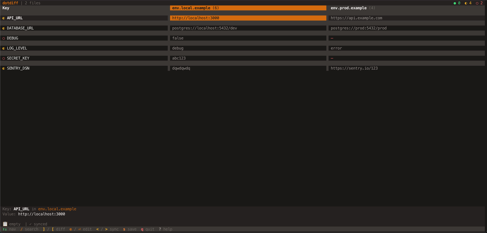

# dotdiff

A TUI tool to compare and sync `.env` files side-by-side. Built with Effect, @effect/cli, and OpenTUI.



## Features

- **Side-by-side comparison** — View 2+ env files with diff highlighting
- **Real-time file watching** — External changes auto-reload
- **Inline editing** — Edit values directly in the TUI
- **Clipboard operations** — Copy/paste between files
- **Sync operations** — Push values left/right across files
- **Undo/redo** — Full history with revert support
- **Search** — Fuzzy find variables by key
- **Pending changes** — Preview before saving
- **Batch operations** — Paste/delete to all files at once

## Install

```bash
# npm
npm install -g dotdiff

# pnpm
pnpm add -g dotdiff

# bun
bun add -g dotdiff
```

> **Note**: dotdiff installs a native binary for your platform automatically. Supported: macOS (Intel/Apple Silicon), Linux (x64/arm64), Windows (x64).

## Usage

Compare two or more env files:

```bash
dotdiff .env.local .env.prod
```

Compare multiple environments:

```bash
dotdiff .env.dev .env.staging .env.prod
```

Get help:

```bash
dotdiff --help
```

## Keybindings

### Navigation

| Key | Action |
|-----|--------|
| `↑` `↓` / `j` `k` | Navigate rows |
| `←` `→` / `h` `l` | Navigate columns |
| `Tab` | Cycle columns |
| `]` / `[` | Jump to next/prev diff |
| `/` | Search keys |
| `Esc` | Cancel search/edit |

### Editing

| Key | Action |
|-----|--------|
| `e` / `Enter` | Edit value |
| `a` | Add new variable |
| `d` | Delete from current file |
| `D` | Delete from all files |

### Clipboard & Sync

| Key | Action |
|-----|--------|
| `c` | Copy value |
| `v` | Paste value |
| `V` | Paste to all files |
| `<` / `>` | Sync value left/right |

### History

| Key | Action |
|-----|--------|
| `r` | Revert cell to original |
| `R` | Revert all changes |
| `u` | Undo |
| `U` | Redo |

### File Operations

| Key | Action |
|-----|--------|
| `s` | Save changes (with preview) |
| `q` | Quit |
| `?` | Show help |

## Status Indicators

The title bar shows variable status counts:

- `●` **Identical** — Same value in all files
- `◐` **Different** — Values differ between files
- `○` **Missing** — Variable not present in some files

Pending changes are highlighted until saved.

## Tech Stack

- **Runtime**: [Bun](https://bun.sh)
- **Framework**: [Effect](https://effect.website) TypeScript
- **CLI**: [@effect/cli](https://github.com/Effect-TS/effect/tree/main/packages/cli)
- **TUI**: [OpenTUI](https://github.com/opentui/opentui) with React renderer
- **State**: [effect-atom](https://github.com/effect-atom/effect-atom)

## Development

```bash
# Install dependencies
bun install

# Run in dev mode
bun run dev .env.local .env.prod

# Type check
bun run typecheck

# Lint
bun run lint

# Run tests
bun test

# Build for current platform
bun run build

# Build for all platforms
bun run build:all

# Generate platform packages
bun run build:packages
```

### Releasing

This project uses [changesets](https://github.com/changesets/changesets) for versioning.

```bash
# Add a changeset (when you make a notable change)
bunx changeset

# Version bump (CI does this automatically)
bunx changeset version

# Publish (CI does this automatically on merge to main)
bun run release
```

## Architecture

```
src/
├── components/     # React TUI components
├── hooks/          # React hooks for state access
├── services/       # Effect services (parser, writer, watcher)
├── state/
│   ├── atoms/      # Atomic state definitions
│   └── operations/ # State update operations
└── utils/          # Pure utility functions
```

Key patterns:
- **Effect Services** — `EnvParser`, `EnvWriter`, `FileWatcher`, `EnvDiffer`
- **Atomic State** — effect-atom for reactive state with Effect integration
- **Mode State Machine** — `AppMode` handles Normal/Edit/Search/Modal states

## License

MIT
